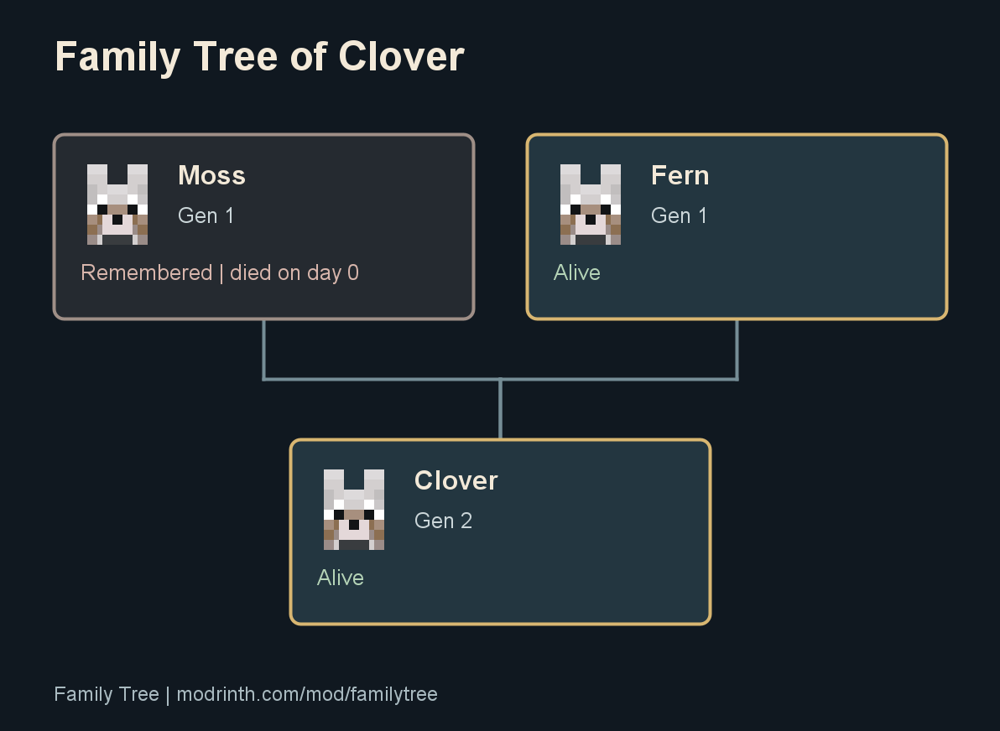
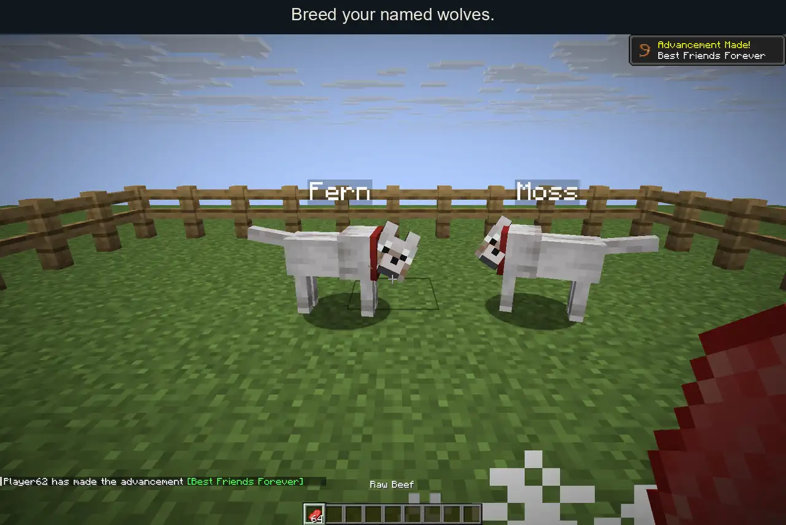
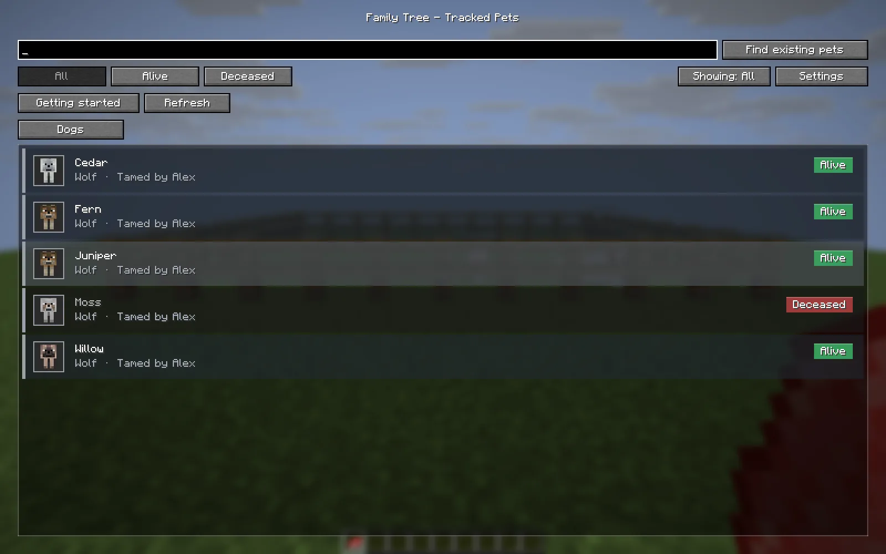
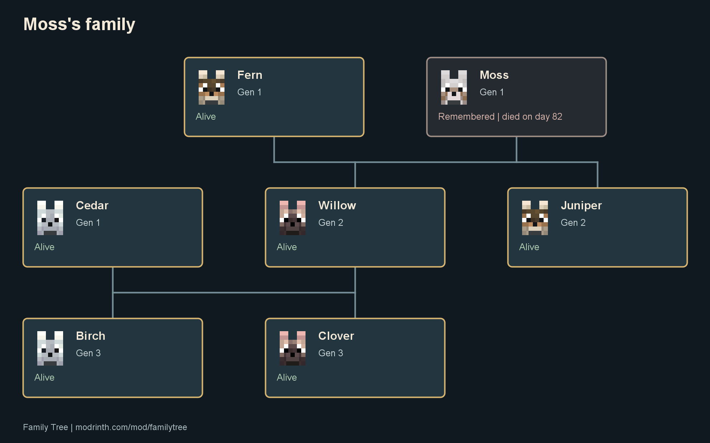

# Family Tree

[](https://modrinth.com/mod/familytree)

Keep the family history of your Minecraft pets. See who their parents were, find a missing pet's last known location, and save a family tree as an image.

[Download Family Tree](https://modrinth.com/mod/familytree/versions)

[CurseForge project](https://www.curseforge.com/minecraft/mc-mods/family-tree), submitted with all eight 1.1.0 builds and awaiting moderator approval.



Keep your first wolf in the family tree after it's gone. Family Tree records parents and descendants as you play, then exports the family as a PNG.



An automated scene in Minecraft 26.2. Vanilla feeding and AI breeding produce the actual puppy. Family Tree records its parents and retains its deceased ancestor. [Landscape video](docs/family-tree-gameplay.mp4) and [vertical video](docs/family-tree-gameplay-vertical.mp4) are ready to share.

## Install

Choose the file that matches both your Minecraft version and mod loader.

| Minecraft | Loader | Java | Extra dependency |
| --- | --- | --- | --- |
| 1.21.1 | Fabric | 21 or newer | [Fabric API](https://modrinth.com/mod/fabric-api) for 1.21.1 |
| 1.21.1 | NeoForge 21.1.252 or newer within 21.1 | 21 or newer | None |
| 26.1.1 | Fabric | 25 or newer | Fabric API for 26.1.1 |
| 26.1.2 | Fabric | 25 or newer | Fabric API for 26.1.2 |
| 26.2 | Fabric | 25 or newer | Fabric API for 26.2 |
| 26.2 | NeoForge 26.2.0.88 or newer within 26.2 | 25 or newer | None |
| 26.3 | Fabric | 25 or newer | Fabric API for 26.3 |
| 26.3 | NeoForge 26.3.0.37-beta or newer within 26.3 | 25 or newer | Beta loader |

Put the matching jar in `mods/`. Fabric builds use Fabric Loader 0.19.3 for testing. NeoForge builds do not need Fabric API.

Install Family Tree on the server for tracking and on your client for the screens. In singleplayer, one installation does both. Use the same Family Tree version on both sides. Players without the mod can join a server that has it, but cannot open the screens.

## Start with the pets you already have

1. Join your world and press **H**. You can change the key under Options > Controls > Family Tree.
2. Visit your pets. Family Tree records existing tamed pets as their chunks load. **Find existing pets** also checks the pets currently loaded on the server.
3. Open a pet's tree, or choose a species to see its combined family trees. Breed pets while the mod is installed to record their children's parents automatically.

The tracker covers tamed cats, wolves, parrots, horses, donkeys, mules, and llamas. Parrots have individual records but cannot breed in vanilla Minecraft. Cat and wolf cards have portraits that match their coat variants.

Minecraft does not retain older parentage or birth dates. Newly discovered pets start with an unknown family and the discovery day as their recorded birth day. Select a pet and choose **Add parents** to record a family you remember. The picker searches names, species, and UUIDs. Confirm the two parents before saving. The linking stick and age commands also remain available. Horse and donkey parents can link to a mule.

## Browse, find, and remember

Search by pet name or species, filter living or deceased pets, and follow generations through a tree you can pan and zoom. Select a pet to center it, rename it in the tree, or locate it. Custom tree names leave name tags in the world unchanged.

**Locate pet** reports coordinates, dimension, and distance in chat. If the pet is unloaded, it reports the last recorded location and day. It does not load chunks or teleport pets.

Death records retain the pet's name, family, death day, and cause when known. Settings let you show or hide generation, age, and birth day. Hide a branch to focus on one part of a large family, then use **Show all** to restore it.



## Export a family tree

Click **Export family tree**, then **Open folder** to find the saved PNG. Export saves a PNG under `screenshots/familytree/` in your Minecraft folder. The image includes the whole visible tree at a fixed, readable scale, regardless of your current zoom or pan. Hidden branches stay hidden. Very large trees need to be narrowed down before export.

Exports include pet names, generations, portraits where available, and living or deceased status. They omit player names and coordinates. Nothing uploads automatically.



## Existing families and server permissions

Rename a stick to `familytree` in an anvil. Right-click the first parent, second parent, and child, then confirm in chat. Sneak and right-click a pet to clear its parents after confirmation. Manual links require distinct pets and reject ancestry loops. Horse and donkey parents can link to a mule.

Owners and server operators can locate or edit their pets. Linking two parents requires permission for all three animals. By default, only operators can browse everyone's pets. A server can change `viewPolicy` in `config/familytree-server.properties` to `EVERYONE_ALL` or `OWN_ONLY`, then restart. Public viewing does not grant editing rights or reveal other players' pet locations.

[Command reference](docs/commands.md) includes locating, pairing, age corrections, and operator pruning.

## Upgrading to 1.1.0

Existing Family Tree history and custom names remain. This release does not change saved field names or add required save fields. Update the server and clients together because the screen protocol changed. Minecraft world version restrictions still apply, so the 1.21.1 build is for 1.21.1 worlds, not for downgrading a newer world.

[Latest release notes](docs/releases/1.1.0.md) | [1.0.0 release notes](docs/releases/1.0.0.md)

## Build and test

Install JDK 25 and JDK 21, then use the included Gradle wrapper. The 1.21.1 jar targets Java 21 bytecode.

```sh
./gradlew buildAll
./gradlew :1.21.1:build
./gradlew :26.2:build
./gradlew -p neoforge build
```

Fabric jars are in `versions/<minecraft>/build/libs/`. NeoForge jars are in `neoforge/build/<minecraft>/libs/`. `buildAll` runs the shared tests for all eight targets. Stonecutter generates Fabric sources for each version, and NeoForge compiles the generated sources for its selected target with its own event and networking entrypoints. Do not edit generated files under `versions/`.

See [runtime validation](docs/testing.md) for the separate server smoke tests and client demo. [CLAUDE.md](CLAUDE.md) covers the source layout and save compatibility rules.

## License

[MIT](LICENSE)

## Releases and download progress

Version 1.1.0 uses paged network snapshots. Update clients and servers together. It preserves existing history, keeps unreadable records in the save, and disables writes to an unsupported future save format. Operator pruning writes a backup before deleting records.

[Release notes](docs/releases/1.1.0.md), [runtime checks](docs/testing.md), and [public download counts](docs/metrics/README.md) describe the release and progress toward 10,000 Modrinth downloads. Run `python scripts/download_counts.py` to update the public counters. The daily GitHub workflow does the same. Repeat downloads and upgrades count toward platform totals.

Build all targets with JDK 25 and JDK 21 installed using `./gradlew buildAll --no-parallel`. Commit the tested source, then run `python scripts/release_manifest.py` to verify jar metadata, Java targets, license, icon, and hashes. Publish the copies under `build/releases/1.1.0/`.
